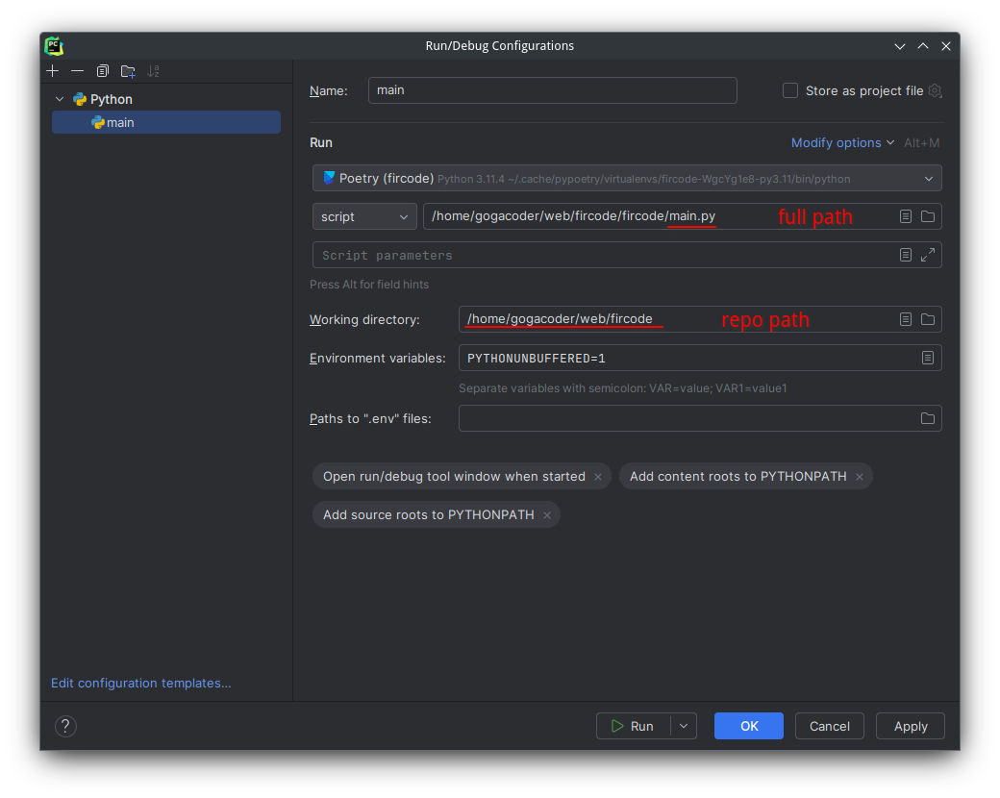

# Ёлкин код
**Attention**: use ```git clone --recurse-submodules https://github.com/Georgiy10427/fircode.git``` to clone this repo with submodules
## Installation (CLI)
0. [Install Poetry](https://python-poetry.org/docs/#installation)
1. Clone this repository and go into this one in a console
2. Install dependencies: `poetry install`
3. Setup Postgres or add `USE_SQLITE = "False"` to `.env`
4. Run server (in the root of this repo): `poetry run start`

## Installation (Pycharm)
0. [Install Poetry](https://python-poetry.org/docs/#installation)
1. Clone this repository and open it into the IDE
2. Pycharm will suggest you to resolve dependencies with Poetry. You need to agree.
3. Setup Postgres or add `USE_SQLITE = "False"` to `.env`
4. Setup FastAPI configuration like that:


## Deployment
Ready instance: https://shelter.gogacoder.com  
This application is deployed with Docker Compose. 
Clone repo and place docker compose file a directory below.
```yaml
version: '3.1'

services:
  backend:
    build: ./fircode
    restart: unless-stopped
    env_file: .env
    ports:
      - "127.0.0.1:6000:443"
    depends_on:
      - db
    networks:
      - net
    volumes:
      - /etc/letsencrypt/live/shelter.gogacoder.com/:/app/certs/:ro
      - /etc/letsencrypt/archive/shelter.gogacoder.com/:/etc/letsencrypt/archive/shelter.gogacoder.com/:ro
      - /etc/letsencrypt/live/shelter.gogacoder.com/:/etc/letsencrypt/live/shelter.gogacoder.com/:ro

  db:
    image: postgres:16-alpine
    restart: unless-stopped
    volumes:
      - ./postgres:/var/lib/postgresql/data 
    environment:
      POSTGRES_USER: shelter
      POSTGRES_PASSWORD: mypass
      POSTGRES_DB: shelter
    networks:
      - net
 
networks:
  net:
    external: false
```
You need to create certs via LetsEncrypt and mount it into docker container. Nginx repo placed in the repository with ```shelter.conf```
Also you need provide `.env` file with database credentials from docker-compose.yaml.
